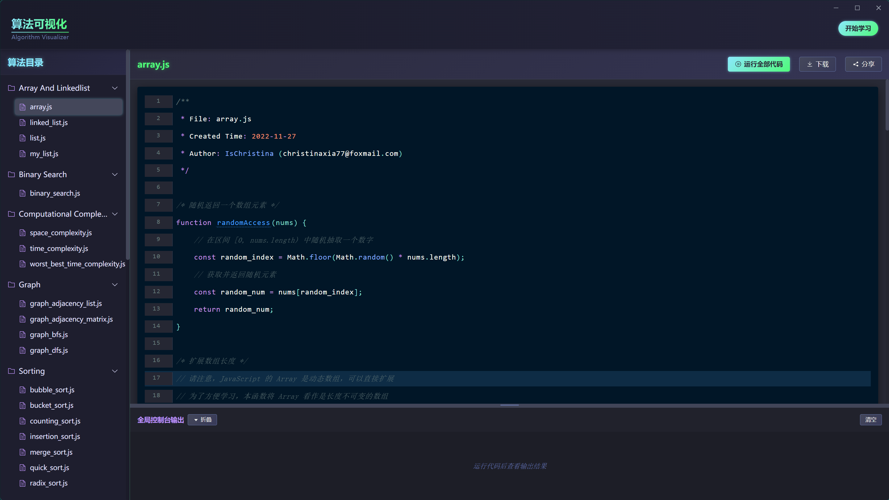
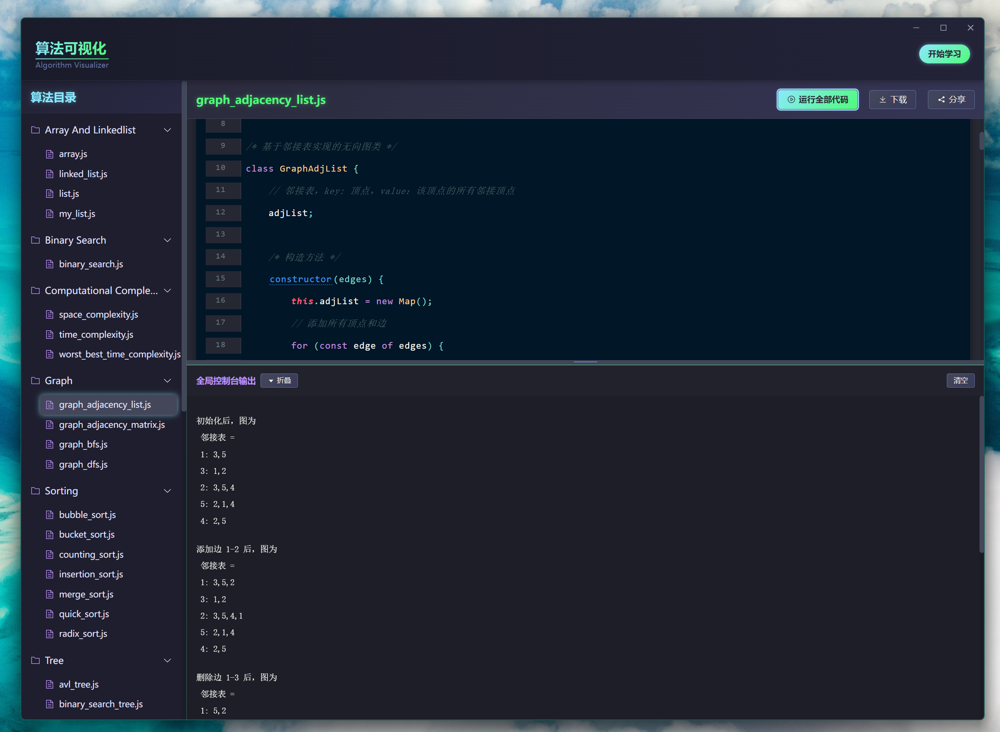
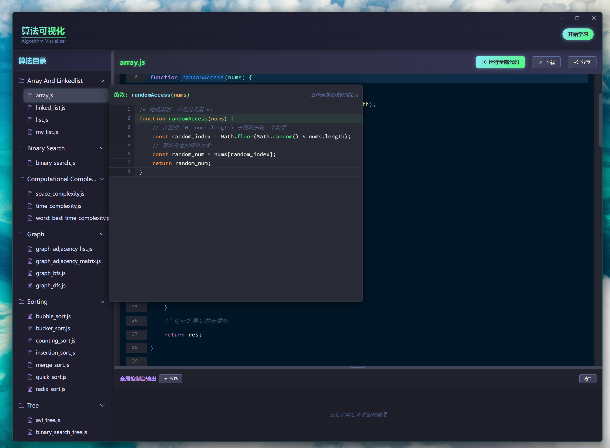

<p align="center">
  
</p>

<p align="center">
  
  
  
  
</p>

# 算法可视化器

<p align="center">一个用于展示和解释各种经典算法实现和运行过程的可视化工具。本项目基于Vue 3和Vite构建，帮助用户直观理解各类算法的工作原理和执行过程。</p>

> [!NOTE]
>
> 若本项目对您有所帮助，请在页面右上角点个 **Star** :star: 支持一下，谢谢！

## 项目灵感

本项目的灵感来源于为 [Hello 算法](https://github.com/krahets/hello-algo) 开源书籍添加一个方便运行其中JavaScript算法代码的可视化界面。Hello 算法是一本动画图解、一键运行的数据结构与算法教程，支持多种编程语言。本可视化器旨在提供更直观的方式来理解和运行这些算法实现。

<p align="center">
  <a href="https://github.com/krahets/hello-algo">
    
  </a>
</p>

<p align="center">
  <a href="https://github.com/krahets/hello-algo">《Hello 算法》</a> —— 动画图解、一键运行的数据结构与算法教程
</p>

## 项目特性

- ✨ **交互式算法可视化界面**：直观展示算法运行过程
- 🔍 **代码和可视化同步展示**：同时查看代码实现与运行效果
- 📚 **支持多种经典算法**：覆盖10+种常见算法类别
- 🚀 **易于理解的算法执行过程**：通过可视化帮助理解算法原理
- 📱 **响应式设计**：适应不同设备屏幕大小

## 在线演示

现在您可以直接访问我们的在线演示地址，无需本地部署即可体验：

🔗 **[算法可视化器在线演示](https://hongliangsam.github.io/algorithm-visualizer/)**

## 包含的算法

本项目包含以下几类算法：

- **数组和链表**: 数组操作、链表操作
- **二分查找**: 二分搜索算法
- **计算复杂度**: 时间复杂度、空间复杂度分析
- **图算法**: 邻接表、邻接矩阵、广度优先搜索(BFS)、深度优先搜索(DFS)
- **哈希**: 哈希表、哈希映射
- **堆**: 堆数据结构
- **搜索算法**: 线性搜索、哈希搜索、LeetCode经典问题
- **排序算法**: 冒泡排序、插入排序、归并排序、快速排序等
- **栈和队列**: 数组栈、链表栈、数组队列、链表队列、双端队列
- **树算法**: 二叉树、二叉搜索树、AVL树、树的广度优先和深度优先遍历

## 项目截图

<p align="center">
  
</p>

<p align="center">
  
</p>

## 使用方法

```bash
# 安装依赖
npm install
# 或
pnpm install

# 启动开发服务器
npm run dev
# 或
pnpm dev

# 构建生产版本
npm run build
# 或
pnpm build
```

> [!TIP]
> 初次使用时，建议先浏览一下项目界面，熟悉各项功能和操作方法。

## 项目结构

- `src/components`: Vue组件
- `src/views`: 页面视图
- `src/scripts/chapters`: 按章节组织的算法实现
- `src/router`: 路由配置
- `src/assets`: 静态资源
- `src/utils`: 工具函数

## 学习指南

算法学习的建议步骤：

1. 先通过 [Hello 算法](https://github.com/krahets/hello-algo) 了解基础的数据结构与算法知识
2. 使用本可视化工具查看各类算法的执行过程和代码实现
3. 尝试自己修改代码或参数，观察算法行为的变化
4. 结合实际问题，思考算法的应用场景和优化方向

## 贡献指南

欢迎贡献新的算法实现或改进现有算法。请确保新添加的算法包含详细注释，解释核心步骤和原理。

## License

本项目代码和文档采用 [MIT License](LICENSE) 许可证。
